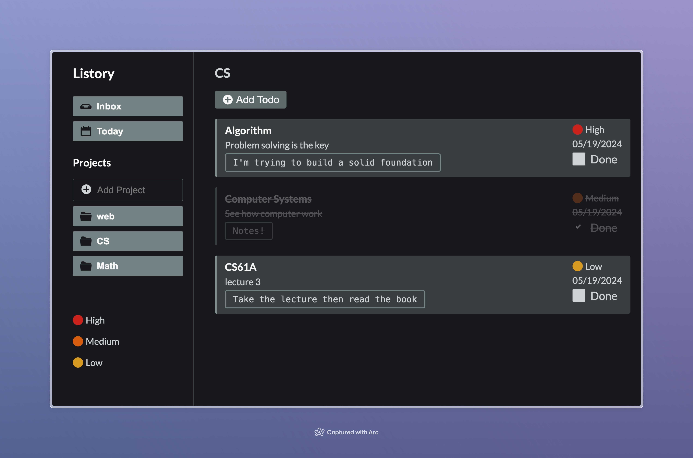

# Listory

Todo List app in the browser

## Features

- Create Project.
- Create Todo items.
- Create Todo items for specific project.
- Add priority, date, notes, and complete to todo.
- Save projects and todo in local storage API.

### Acknowledgement

[TOP](https://www.theodinproject.com/lessons/node-path-javascript-todo-list)
